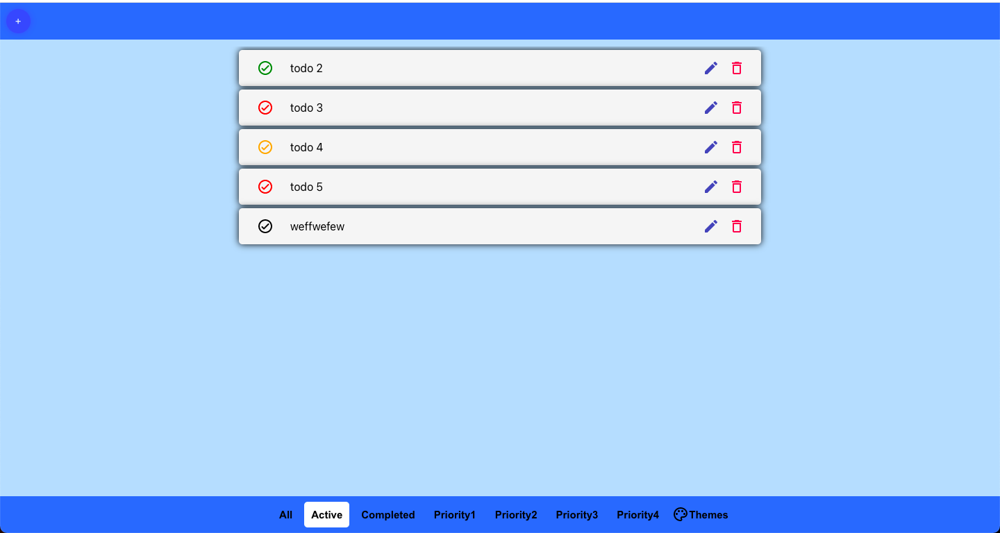
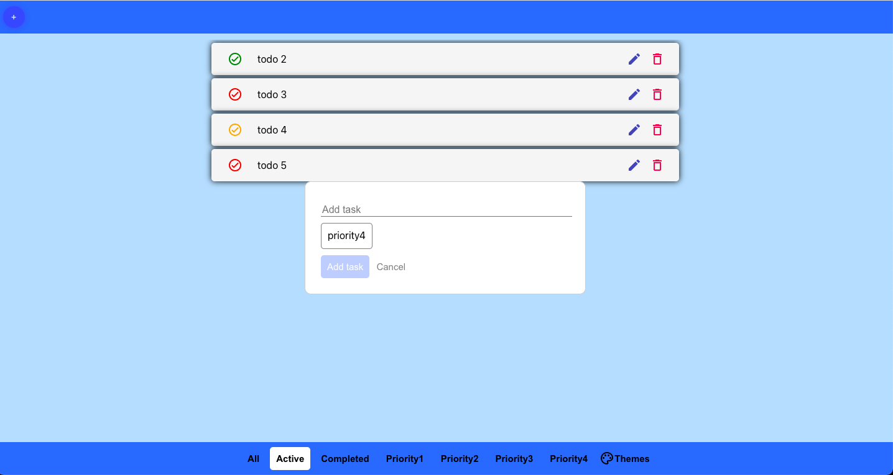
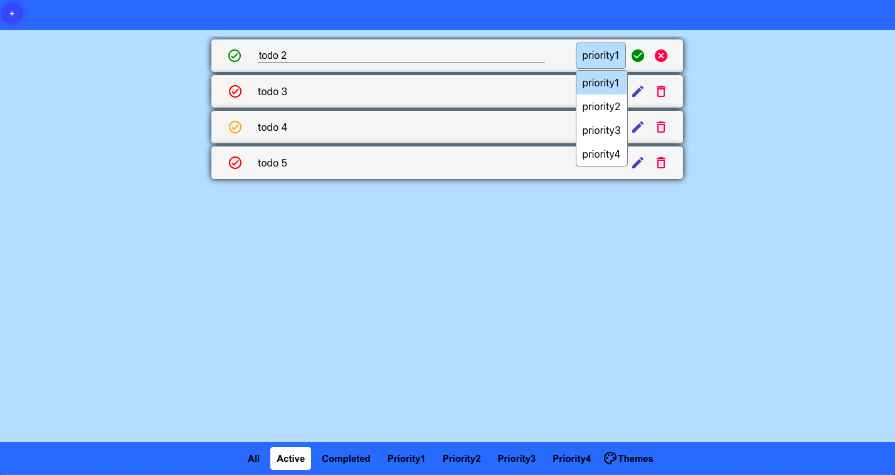
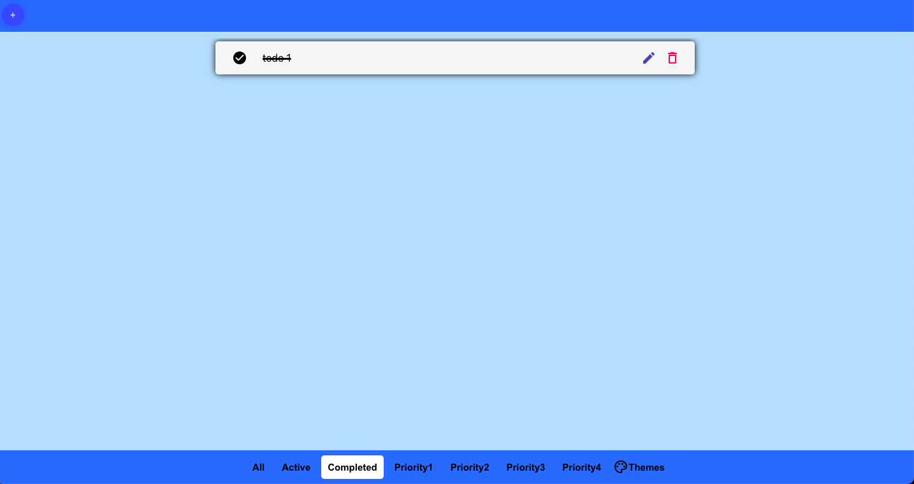
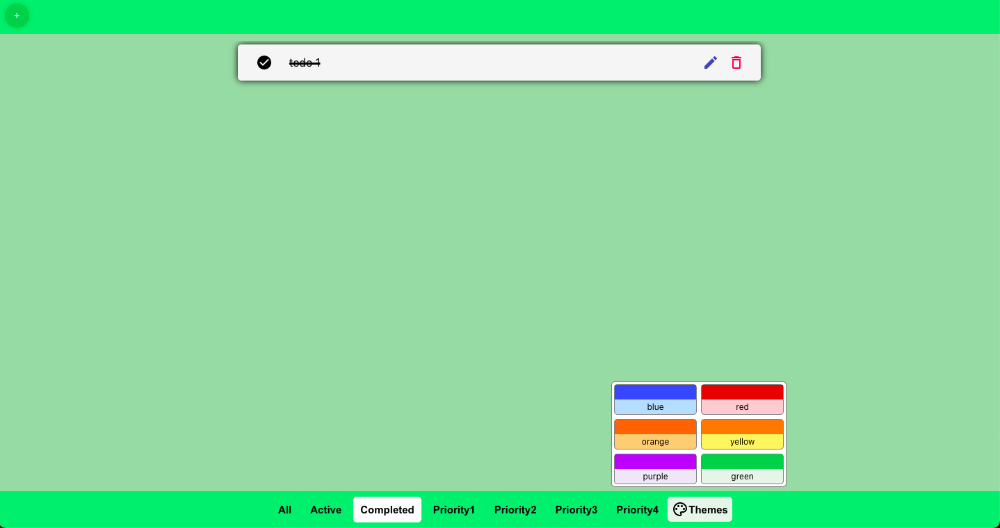

# HOMEPAGE

https://romanca.github.io/typescript-tutorial/

# App is containing

- React
- Typescript
- Cypress(end-to-end testing automation)

### Functionality

- Creating todos
- Editing todos
- Deleting todos
- Selecting priorities
- Changing themes
- Filtering todos
